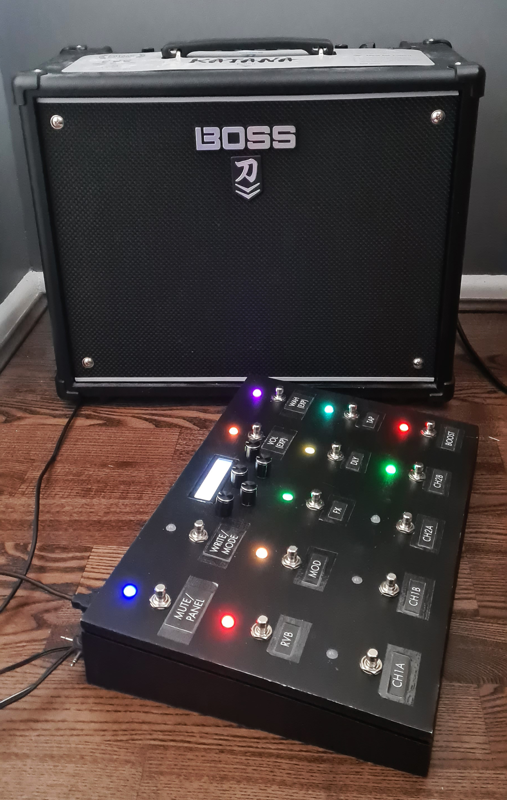

# Katana-Solutions-USB-MIDI-Foot-Controller
A Teensy 4.1 (arduino-based) USB MIDI Foot Controller for a Boss Katana MKII guitar amp. Featuring 14 momentary footswitches, 14 RGB LEDs, 5 rotary encoders and an LCD display.

This code has not been tidied up yet! There are a lot of improvements that could be made! This is only intended as a personal project an will be updated in the future to improve of formatting, comments, code structre etc.

# Core Design
The core functionality is modelled around the 'command' design pattern and a directed graph-like structure for the core menu system.

